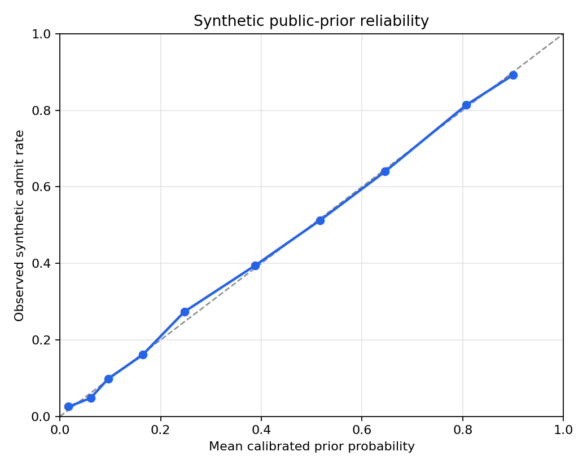

# Calibration Report

This report is for Fitty's Phase 2 synthetic public-data prior model, not real-outcome accuracy.

## Synthetic Reliability

| Bin | Mean predicted | Observed synthetic admit rate | Count |
|---|---:|---:|---:|
| 1 | 0.017 | 0.025 | 511 |
| 2 | 0.061 | 0.048 | 561 |
| 3 | 0.096 | 0.098 | 599 |
| 4 | 0.164 | 0.161 | 348 |
| 5 | 0.247 | 0.274 | 519 |
| 6 | 0.388 | 0.394 | 644 |
| 7 | 0.516 | 0.512 | 283 |
| 8 | 0.646 | 0.640 | 447 |
| 9 | 0.807 | 0.814 | 408 |
| 10 | 0.899 | 0.892 | 480 |

Held-out synthetic test Brier score: `0.1397`  
Held-out synthetic test log loss: `0.4389`

## Mean Interval Width By Selectivity Tier

Intervals are generated from held-out MAPIE residuals and widened by tier-specific public-prior uncertainty floors. The intended product behavior is that public-data-only ranges get wider as selectivity rises.

| Tier | Test examples | Mean interval width | Exported half-width |
|---|---:|---:|---:|
| accessible | 1,248 | 0.290 | 0.157 |
| selective | 1,248 | 0.353 | 0.180 |
| highly_selective | 1,248 | 0.413 | 0.270 |
| elite | 1,056 | 0.523 | 0.460 |

## Honesty Statement

This is a synthetic prior model, not a validated real-world admissions model. Its labels are generated from public anchors: published admit rate, position relative to published middle-50% bands, and public ED/RD rates where available. Synthetic calibration is useful for testing the artifact contract and for enforcing wide uncertainty where public data cannot see essays, recommendations, institutional priorities, and class-shaping needs. It is not evidence of individual real-world accuracy.

Run details: seed `20260616`, `320` synthetic applicants per school, model type `public_prior_logistic_v1`.
